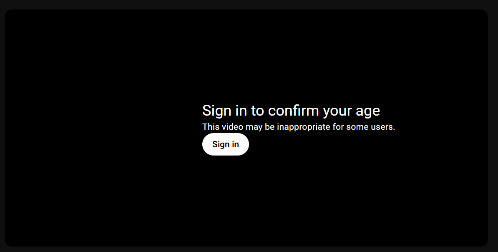
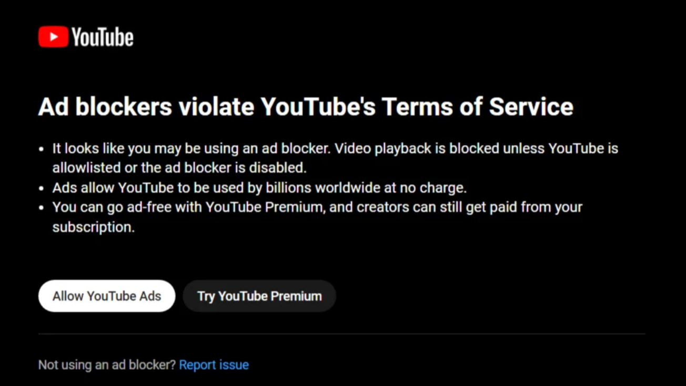

# BooTube

YouTube Restriction Bypass Tool

## YouTube Restriction Bypass

Any youtube video which is restricted due to 

- age verification
- adblock-ban
- geo location

can be bypassed via NSFW mirror links in which the videos are embedded. 
Youtube has been often in the discussion due to their **adblock policy** and although [ublock origin](https://github.com/gorhill/uBlock) is often close behind to youtube's changes and bans. However, there are still periods during transitions in which users have no other option than to disble their adblockers. Here BooTube comes in! Give back the user the ability to bypass any restrictions comfortably with a single shortcut.

## Install

```bash
pip install https://b0-b.github.io/bootube/
```

## Usage
Clone the repository and via pip

```bash
pip install .
```

Start bootube in a background terminal.

```python
python bootube.py
```

Next navigate to a Youtube video with restriction like [this one](https://www.youtube.com/watch?v=IzociekIWRA&list=PLWXebDcwBu-x6RNQWKhYwNwOQmMvadExf&index=2) shown below



or if an adblocker notification like this one shows up



Make sure to focus onto the browser window if not already (e.g. by clicking somewhere on it) and simply type ``SHIFT + Y`` and the video should automatically start in a new tab.